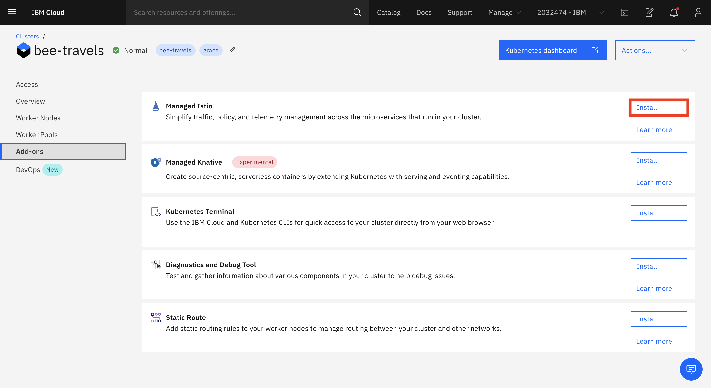

<!-- Put badges at the very top -->
<!-- Change the repo -->
[](https://travis-ci.org/IBM/watson-banking-chatbot)

# Building an Istio 1.6 Service Mesh for Bee Travels, a Microservice Application Deployed on Kubernetes

In this code pattern, we will deploy a microservices application to the cloud with Kubernetes and create a service mesh with Istio 1.6. [Explain briefly how things work]. [Give acknowledgements to others if necessary]

When you have completed this code pattern, you will understand how to:

* Deploy microservices application on Kubernetes
* Configure an Istio service mesh
  * Route traffic to specific microservice versions
  * Shift traffic between multiple microservice versions
  * Access distributed trace spans through Jaeger
  * Analyze service traffic and latency through Grafana
  * Observe the service mesh through Kiali (?)
  * View access logs 

<!--add an image in this path-->


<!--Optionally, add flow steps based on the architecture diagram-->
## Flow

1. Step 1.
2. Step 2.
3. Step 3.
4. Step 4.
5. Step 5.

# Steps

1. [Complete the prerequisite IBM Cloud set-up](#1.-Prerequisite-IBM-Cloud-set-up)
2. [Clone the repository](#2.-Clone-the-repository)
3. [Deploy the application to Kubernetes](#3.-Deploy-to-Kubernetes)
4. Configure the Istio service mesh

## 1. Prerequisite IBM Cloud set-up

[Sign up for an IBM Cloud account.](https://cloud.ibm.com/docs/account?topic=account-signup) if you do not have one. You must have a Pay-As-You-Go or Subscription account to deploy this code pattern. See [here](https://cloud.ibm.com/docs/account?topic=account-upgrading-account) to upgrade your account.

[Install the IBM Cloud CLI.](https://cloud.ibm.com/docs/cli?topic=cli-getting-started#idt-prereq)

[Provision a new Kubernetes cluster.](https://cloud.ibm.com/docs/containers?topic=containers-clusters#clusters_standard)
> NOTE: This may take up to 30 minutes

When your cluster has been created, navigate to the `Add-ons` tab on the left side of your cluster dashboard. Click **Install** for the Managed Istio Add-on.


After Istio has finished installing, [install the `istioctl` CLI.](https://cloud.ibm.com/docs/containers?topic=containers-istio#istioctl)

[Customize your Istio installation](https://cloud.ibm.com/docs/containers?topic=containers-istio#customize) by following steps 1 through 4 to enable monitoring and increase trace sampling to 100.
* Your configmap resource should look like this:


If you haven't already, log in to IBM Cloud using the command line.
```bash
$ ibmcloud login
```

Set the cluster that you created as the context for this session.
```bash
$ ibmcloud ks cluster config -c <cluster_name_or_ID>
```

Verify that `kubectl` commands run properly and that the Kubernetes context is set to your cluster.
```bash
$ kubectl config current-context
```
* Example output:
```bash
<cluster_name>/<cluster_id>
```

## 2. Clone the repository

Clone the `REPO_NAME` repository locally. In a terminal window, run:

```BASH
$ git clone REPO_LINK
$ cd K8_DIR
```

## 3. Deploy to Kubernetes

Enable Istio sidecar injections.
```bash
$ kubectl label namespace default istio-injection=enabled
```

Deploy the Bee Travels application.
```bash
```


<!-- template -->
# Troubleshooting

* Error: Environment {GUID} is still not active, retry once status is active

  > This is common during the first run. The app tries to start before the Watson Discovery
environment is fully created. Allow a minute or two to pass. The environment should
be usable on restart. If you used **Deploy to IBM Cloud** the restart should be automatic.

* Error: Only one free environment is allowed per organization

  > To work with a free trial, a small free Watson Discovery environment is created. If you already have
a Watson Discovery environment, this will fail. If you are not using Watson Discovery, check for an old
service thay you might want to delete. Otherwise, use the `.env DISCOVERY_ENVIRONMENT_ID` to tell
the app which environment you want it to use. A collection will be created in this environment
using the default configuration.

<!-- keep this -->
## License

This code pattern is licensed under the Apache License, Version 2. Separate third-party code objects invoked within this code pattern are licensed by their respective providers pursuant to their own separate licenses. Contributions are subject to the [Developer Certificate of Origin, Version 1.1](https://developercertificate.org/) and the [Apache License, Version 2](https://www.apache.org/licenses/LICENSE-2.0.txt).

[Apache License FAQ](https://www.apache.org/foundation/license-faq.html#WhatDoesItMEAN)