# Building an Istio 1.6 Service Mesh for Bee Travels, a Microservices Based Application Deployed on Kubernetes

In this code pattern, we will deploy a microservices based application to  IBM Kubernetes Service and create a service mesh with Istio 1.6. 

When you have completed this code pattern, you will understand how to:

* Deploy a microservices application on Kubernetes
* Configure an Istio service mesh, including:
  * Install and configure the IBM Managed Istio add-on
  * Route traffic to specific microservice versions
  * Shift traffic between multiple microservice versions (A/B testing)
  * Access distributed trace spans through Jaeger
  * Analyze service traffic and latency through Grafana
  * Visualize the service mesh through Kiali
  * View access logs 
* Generate load tests with [Artillery](https://artillery.io/docs/)

# Architecture

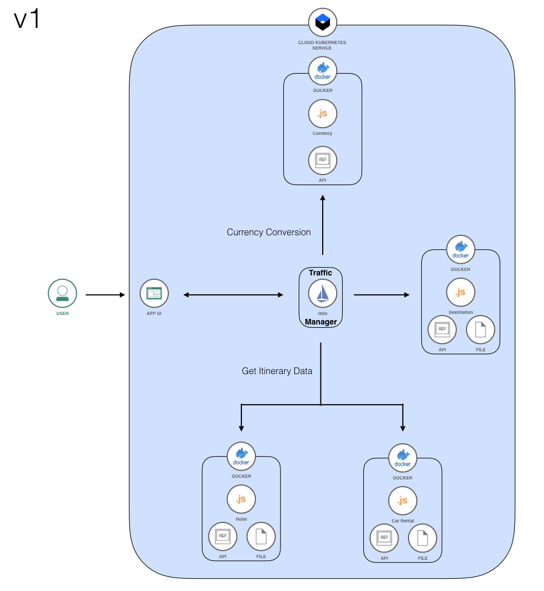
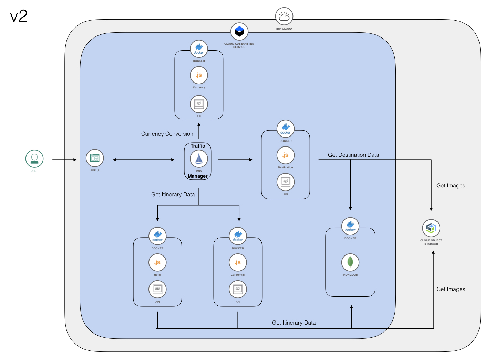
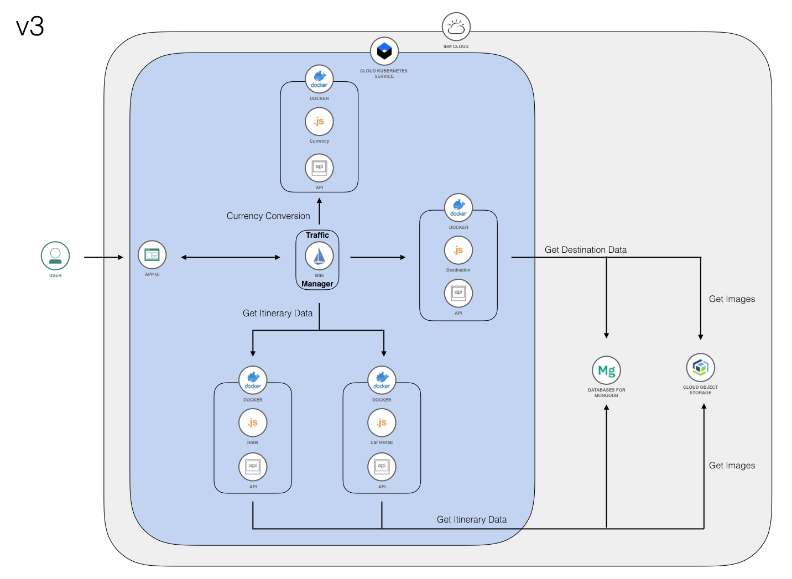

# Prerequisites

* [NodeJS](https://nodejs.org/en/download/)
* [NPM](https://www.npmjs.com/get-npm)
* [Artillery](https://artillery.io/docs/getting-started/)

# Steps

1. [Complete the IBM Cloud set-up for Kubernetes and Istio](#1-Complete-the-IBM-Cloud-set-up-for-Kubernetes-and-Istio)
2. [Clone the repository](#2-Clone-the-repository)
3. [Deploy the application to Kubernetes](#3-Deploy-to-Kubernetes)
   * Deploy version 1 (data stored in json flat files)
   * Deploy version 2 (data stored in an in-cluster database)
   * Deploy version 3 (data stored in a database in the cloud)
   * Access the application (ingress gateway)
4. [Configure the Istio service mesh](#4-Configure-the-Istio-service-mesh)
   * Route traffic to specific microservice versions
   * Shift traffic between multiple microservice versions
   * Access distributed trace spans through Jaeger
   * Analyze service traffic and latency through Grafana
   * Visualize the service mesh through Kiali
   * View access logs

## 1. Complete the IBM Cloud set-up for Kubernetes and Istio

1. [Sign up for an IBM Cloud account.](https://cloud.ibm.com/docs/account?topic=account-signup) if you do not have one. You must have a Pay-As-You-Go or Subscription account to deploy this code pattern. See [here](https://cloud.ibm.com/docs/account?topic=account-upgrading-account) to upgrade your account.

2. [Install the IBM Cloud CLI.](https://cloud.ibm.com/docs/cli?topic=cli-getting-started#idt-prereq)

3. [Provision a new Kubernetes cluster.](https://cloud.ibm.com/docs/containers?topic=containers-clusters#clusters_ui) Follow the steps to create a standard classic cluster.
   > NOTE: This may take up to 30 minutes.

4. When your cluster has been created, navigate to the **Add-ons** panel on the left side of your cluster console. Click **Install** for the Managed Istio Add-on.


5. After Istio has finished installing, install the [`istioctl` CLI](https://istio.io/latest/docs/reference/commands/istioctl/) by running the following:
   ```
   $ curl -sL https://istio.io/downloadIstioctl | sh -
   ```

6. [Customize your Istio installation](https://cloud.ibm.com/docs/containers?topic=containers-istio#customize) by following steps 1 through 4 to enable monitoring and increase trace sampling to 100.
   > Your configmap should look like this:


## 2. Clone the repository

Clone the `bee-travels-istio` repository locally. In a terminal window, run:
   ```
   $ git clone https://github.com/IBM/bee-travels-istio.git
   ```

## 3. Deploy to Kubernetes

1. If you haven't already, log in to IBM Cloud using the command line.
   ```
   $ ibmcloud login
   ```

2. Set the cluster that you created as the context for this session.
   ```
   $ ibmcloud ks cluster config -c <cluster_name_or_ID>
   ```

3. Verify that `kubectl` commands run properly and that the Kubernetes context is set to your cluster.
   ```
   $ kubectl config current-context
   ```
   > Example output:
   ```
   <cluster_name>/<cluster_id>
   ```

4. Enable automatic Istio sidecar injection.
   ```
   $ kubectl label namespace default istio-injection=enabled
   ```

### Deploy version 1 (data stored in json flat files)

1. Navigate to the `bee-travels-istio` root directory and deploy the application with version 1 services:
   ```
   $ ./deploy-k8s-v1.sh
   ```

### Deploy version 2 (data stored in an in-cluster database)
> The following outlines specific steps to connect to an in-cluster MongoDB database, but the Bee Travels application also supports PostgreSQL, CouchDB, and Cloudant.

1. Deploy the application with version 2 services.
   ```
   $ ./deploy-k8s-v2.sh
   ```

2. We have created a [NodePort](https://kubernetes.io/docs/concepts/services-networking/service/#publishing-services-service-types) for MongoDB which exposes the service outside the cluster at `<NODE-IP>:<NODE-PORT>`. Take not of the node port (second port number) of the `mongo` service.
   > For example: 
   
   ```
   $ kubectl get svc mongo
   ```

3. Take not of `EXTERNAL-IP` of any of the nodes in the cluster. This is the `<NODE-IP>` we will use to connect to the MongoDB service as described in step 2.
   ```
   $ kubectl get node -o wide
   ```

4. Run the following script to populate the database that was created.
   ```
   $ ./generate.sh
   ```

5. Answer the prompts as seen below. For the **Database Connection URL**, replace `<NODE-IP>` with the IP address from step 3 and `<NODE-PORT>` from step 2. Use existing credentials when prompted for hotel and car rental data.
   ```
   Welcome to the Bee Travels Data Generating Script
   Please answer the following options to configure your data:

   Destination Data (Y/N): y
      Generate Destination Data (Y/N): n
      Database (mongodb/postgres/couchdb/cloudant): mongodb
      Database Connection URL: mongodb://admin:admin@<NODE-IP>:<NODE-PORT>
      Use SSL/TLS (Y/N): n
   ```

### Deploy version 3 (data stored in a database in the cloud)
> The following outlines specific steps to connect to a MongoDB database in the cloud, but the Bee Travels application also supports PostgreSQL, CouchDB, and Cloudant.

1. [Provision a MongoDB deployment in the cloud.](https://cloud.ibm.com/catalog/services/databases-for-mongodb)

2. When your Mongo as a service deployment has been created, navigate to the **Manage** panel on the left side of your cluster console and click the **Settings** tab. Set a new password for your service connection.


3. Navigate to the **Overview** tab and take note of the **Public mongo endpoint**.


4. Scroll down and download the **TLS certificate**.


5. Run the following script to populate the database that was created.
   ```
   $ ./generate.sh
   ```

6. Answer the prompts as seen below. For the **Database Connection URL**, input the endpoint from Step 3 and replace `$USERNAME` with `admin` and `$PASSWORD` with the password set in step 2. For the **Certificate File Path**, input the path to the TLS certificate downloaded in step 4. Use existing credentials when prompted for hotel and car rental data.
   ```
   Welcome to the Bee Travels Data Generating Script
   Please answer the following options to configure your data:

   Destination Data (Y/N): y
      Generate Destination Data (Y/N): n
      Database (mongodb/postgres/couchdb/cloudant): mongodb
      Database Connection URL:
      Use SSL/TLS (Y/N): y
      Certificate File Path:
   ```

7. Open `k8s/carrental-v3-deploy.yaml` in an editor. Replace `<YOUR URL HERE>` in line 41 to the URL from step 3 and replace `$USERNAME` with `admin` and `$PASSWORD` with the password set in step 2. At the end of your URL, add `&tls=true`. Repeat this step for `k8s/destination-v3-deploy.yaml` and `k8s/hotel-v3-deploy.yaml`.

8. Open the TLS certificate from step 4 and copy its contents **excluding the first and last lines in dashes**. Encode the content by running the following command and take note of the output:
   ```
   $ echo $(cat <TLS_cert>) | base64
   ```

9. Open `k8s/mongo-secret.yaml` in an editor. Set the `dbsecret` in line 7 to the encoded TLS certificate value from step 8.

10. Deploy the application with version 3 services.
   ```
   $ ./deploy-k8s-v3.sh
   ```

At this point, all 3 versions of the destination, hotel, and car rental services should be deployed, along with the UI and currency exchange services.

Confirm that the pods and services are up and running.
```
kubectl get po
```

and 
```
kubectl get svc
```


### Access the application (ingress gateway)

1. Create an ingress gateway so the application is accessibile from outside the cluster.
   ```
   $ kubectl apply -f istio/gateway.yaml
   ```

 2. Access the Bee Travels application by navigating to the IP address defined in `EXTERNAL-IP` of the ingress gateway in the browser.
      ```
      $ kubectl get svc -n istio-system istio-ingressgateway
      ```

## Configure the Istio service mesh

Before we begin the configurations, we will set up Artillery, an external load generator tool. We will be using Artillery to generate traffic to the Bee Travels application. Please make sure that it is installed by following the links in the [Prerequisites](#-Prerequisites) section. 

   1. Open the `artillery_load/artillery.yaml` configuration in an editor and replace `<EXTERNAL-IP>` in line 2 with the `EXTERNAL-IP` of the ingress gateway. Save the file.
         > Make sure that there is no `/` at the end of the address.

### Route traffic to specific microservice versions

1. Before we can set traffic rules, [destination rules](https://istio.io/latest/docs/reference/config/networking/destination-rule/) must to be defined for Istio to identify the service versions available in the application. These different versions are referred to as subsets.
   ```
   $ kubectl apply -f istio/destinationrules.yaml
   ```

2. Confirm that the destination rules have been created. Notice the *subset* field for each service.  
   ```
   $ kubectl get dr -o yaml
   ```

3. We will try visiting the application without setting any virtual service rules. By default, the Envoy proxies will route traffic in a round-robin manner to all eligible destinations. We will be using a custom service graph in the Bee Travels application UI to visualize which pods are receiving traffic. Navigate to the Bee Travels application in the browser and visit the `service-graph` endpoint using the `EXTERNAL-IP` of the ingress gateway (ie. http://EXTERNAL-IP/service-graph)

4. Confirm that all 3 versions of the hotel, car rental, and destination services are receiving traffic. Refresh to see that traffic is being routed to different pods each time.
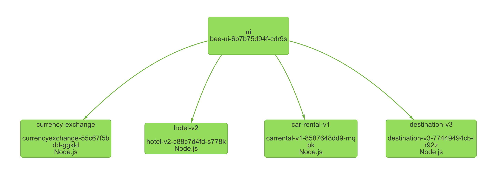

5. We will first try routing all traffic to the `v1` services by applying a set of virtual service rules. Virtual services route traffic to the defined configuration.
   ```
   $ kubectl apply -f istio/virtualservice-all-v1.yaml
   ```

6. Confirm that the `v1` virtual service rules have been applied. Notice the *subset* value for each service's destination is set to `v1`.
   ```
   $ kubectl get vs -o yaml
   ```

7. Use Bee Travel's service graph to confirm that all traffic is being sent to the `v1` services. 


8. We will now route all traffic to the `v2` services by applying a new set of virtual service rules.
   ```
   $ kubectl apply -f istio/virtualservice-all-v2.yaml
   ```

9. Confirm that the `v2` virtual service rules have been applied. Notice the *subset* value for each service's destination is set to `v2`.
   ```
   $ kubectl get vs -o yaml
   ```

10. Use Bee Travel's service graph to confirm that all traffic is being sent to the `v2` services. 
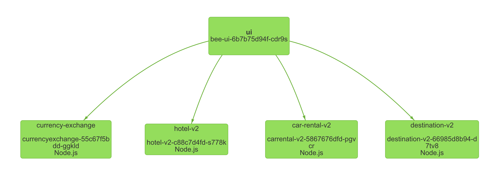

11. Feel free to write and apply your own set of `v3` virtual service rules or try applying `istio/virtualservice-all-v3.yaml` on your own.

### Shift traffic between multiple microservice versions

1. We will be using the Kiali dashboard to visualize traffic shifting. [Set up your Kiali credentials with a secret.](https://istio.io/latest/docs/tasks/observability/kiali/#create-a-secret)

2. Access the Kiali dashboard by running the following command. The dashboard should launch in a browser window automatically, but if it does not, navigate to `localhost:55619/kiali`. You will need to log in with the credentials created in step 1.
   ```
   $ istioctl dashboard kiali
   ```

3. Navigate to the **Graph** panel on the left side of the dashboard and select `default` from the **Namespace** drop-down to show the Bee Travels service graph. Then, click on the **Display** drop-down and select *Request Percentage* and *Traffic Animation* to customize the graph display.
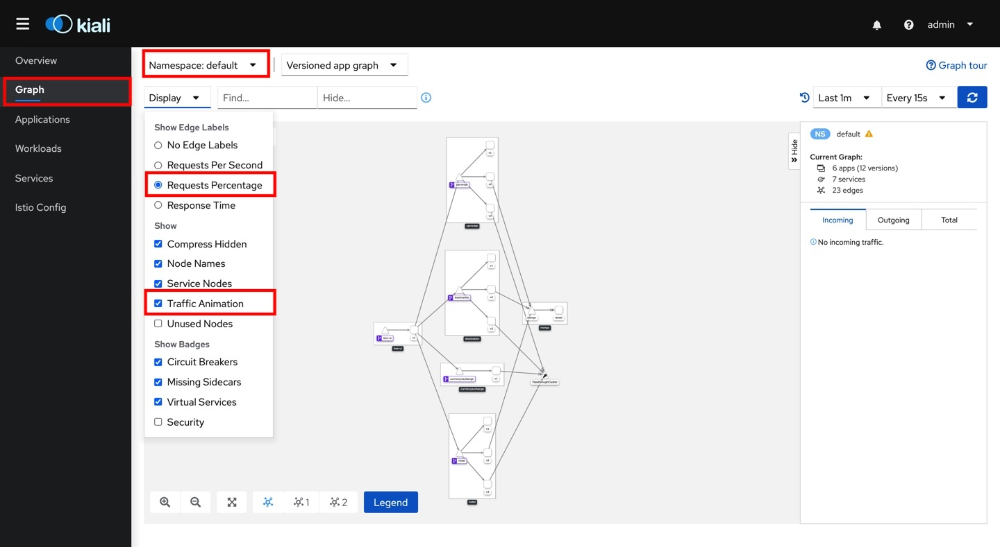

4. We will first define virtual service rules to shift traffic evenly between `v1` and `v3` services. Traffic shifting is also referred to as weight-based routing and is helpful for A/B testing. 
   ```
   $ kubectl apply -f istio/virtualservice-50-v1-v3.yaml
   ```

5. Confirm that the virtual service rules have been applied. Notice the *weight* value for the two `v1` and `v3` destinations of each service is set to `50`.
   ```
   $ kubectl get vs -o yaml
   ```
   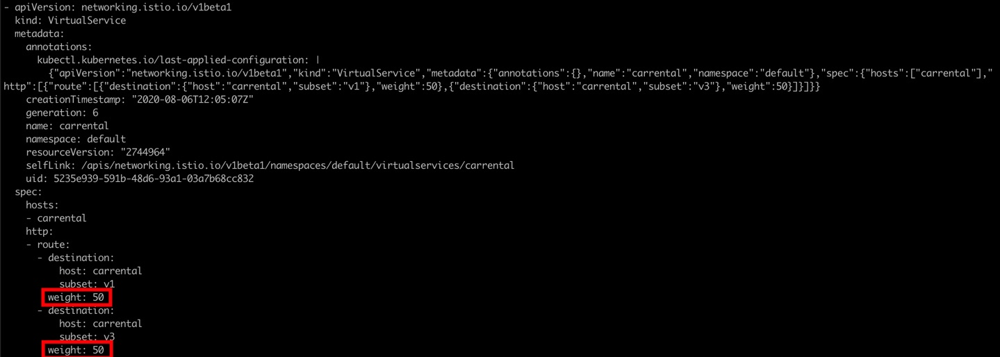

6. Generate traffic to the application using the Artillery script.
   > Before running, ensure that you have updated the `artillery_load/artillery.yaml` file with the correct IP address for your cluster, as described above.
   ```
   $ artillery run artillery_load/artillery.yaml
   ```

7. Navigate to the Kiali dashboard. Notice how traffic is split approximately 50-50 between `v1` and `v3` services.
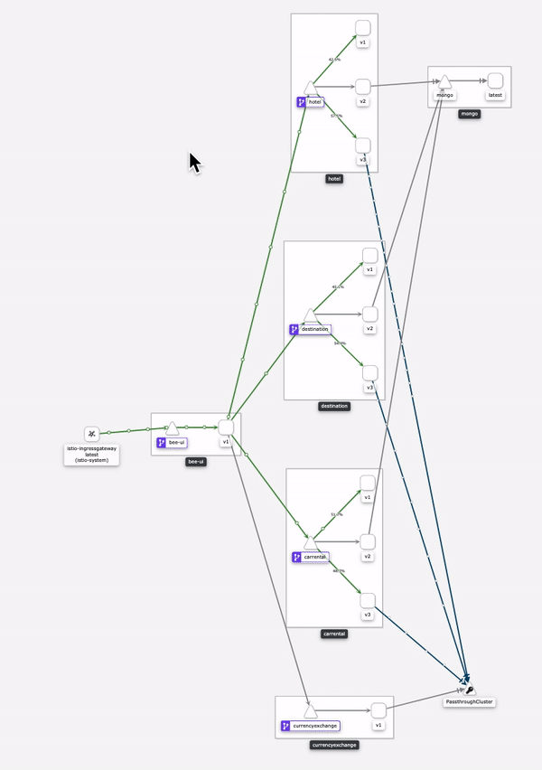 

8. We will now shift traffic to the `v1`, `v2`, and `v3` services at 10%, 30%, and 60%, respectively.
   ```
   $ kubectl apply -f istio/virtualservice-weights.yaml
   ```

9. Confirm that the virtual service rules have been applied. Notice the *weight* value for the `v1`, `v2`, `v3` destinations of each service are set to `10`, `30`, and `60`.
   ```
   $ kubectl get vs -o yaml
   ```
   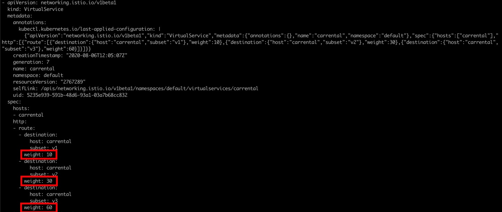

10. Generate traffic to the application using the Artillery script.
   ```
   $ artillery run artillery_load/artillery.yaml
   ```

11. Navigate to the Kiali dashboard. Notice how traffic is split approximately 10-30-60 between the `v1`, `v2`, and `v3` services.
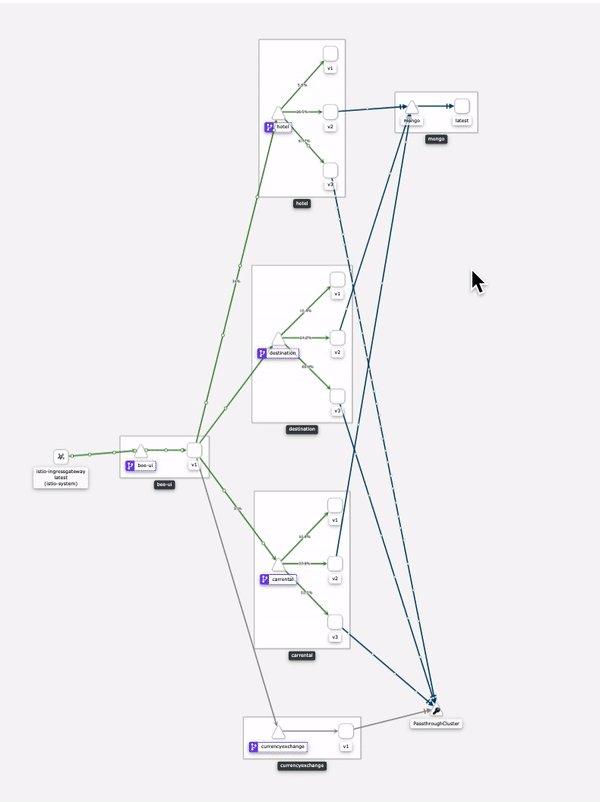

### Access distributed trace spans through Jaeger

[Jaeger](https://www.jaegertracing.io/docs/1.16/#about) is a platform to view distributed traces which shows the flow of information and can help isolate errors.

1. Access the Jaeger dashboard by running the following command. The dashboard should launch in a browser window automatically, but if it does not, navigate to `localhost:55545`.
   ```
   $ istioctl dashboard jaeger
   ```

2. In a different browser tab, navigate to the Bee Travels application, enter a destination, and make a hotel request.


3. In Jaeger, select `hotel.default` from the **Service** drop-down and click **Find Traces**. 


4. Click on the first result item to analyze the trace for the request you just made in the browser. The trace provides information about how long the entire request took to process (`duration`), which specific endpoint was called (`http.url`), which pod/service version processed the request (`node_id`), and more. 


### Analyze service traffic and latency through Grafana

[Grafana](https://grafana.com/grafana/) is a monitoring platform that provides details about the service mesh through a variety of dashboards:

* Mesh Dashboard provides an overview of all services in the mesh.
* Service Dashboard provides a detailed breakdown of metrics for a service.
* Workload Dashboard provides a detailed breakdown of metrics for a workload.
* Performance Dashboard monitors the resource usage of the mesh.
* Control Plane Dashboard monitors the health and performance of the control plane.

For this code pattern, we will focus on the Mesh Dashboard for traffic and latency.

1. [Set up your Grafana credentials with a secret.](https://cloud.ibm.com/docs/containers?topic=containers-istio-health#grafana)

2. Access the Grafana dashboard by running the following command. The dashboard should launch in a browser window automatically, but if it does not, navigate to `localhost:50340`.
   ```
   $ istioctl dashboard grafana
   ```

3. Click the **Home** drop-down and select the **Istio Mesh Dashboard**. You should see a list of all of the services in your cluster.
   
   
   

2. Generate traffic to the application using the Artillery script.
   ```
   $ artillery run artillery_load/artillery.yaml
   ```

3. The Mesh Dashboard provides information about the number of requests the services receive and their latency. The `Requests` column depicts how many requests are coming in per second. The `P50 Latency` describes the average time taken to complete requests, `P90 Latency` describes the time taken for the slowest 10% of requests, and `P99 Latency` describes the time taken for the slowest 1% of requests. Comparing the latency between the different versions, we can see that across all the services, `v1` is the fastest, followed by `v2`, and `v3` is the slowest.
   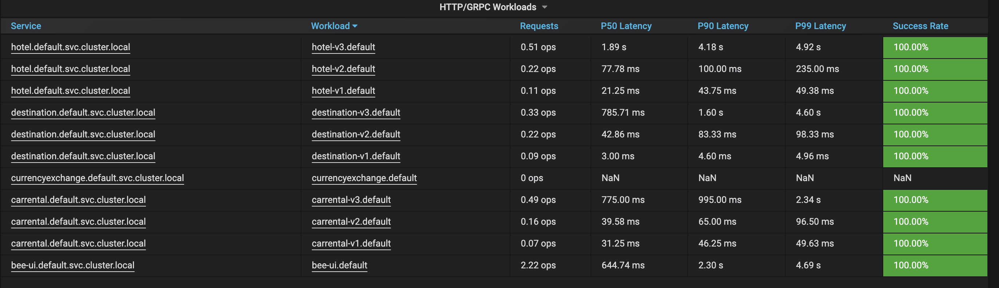

### Visualize the service mesh through Kiali

[Kiali](https://kiali.io/documentation/latest/features/) is a visual representation of the service mesh and its configurations. It includes a topology graph and provides an interface to view the different components of the mesh.

We've used Kiali to visualize the traffic in the mesh and now we explore some other components of the dashboard.

1. Access the Kiali dashboard by running the following command. The dashboard should launch in a browser window automatically, but if it does not, navigate to `localhost:55619/kiali`.
   ```
   $ istioctl dashboard kiali
   ```

3. Navigate to the **Applications** panel on the left side of the dashboard and click on `bee-ui`. The console displays the how deployments and services are connected and shows how the selected application communicates with the other applications in the namespace. The different tabs provide data and metrics about traffic. The  **Workloads** and **Services** panels will allow you to choose a resource and find similar information about deployments and services.
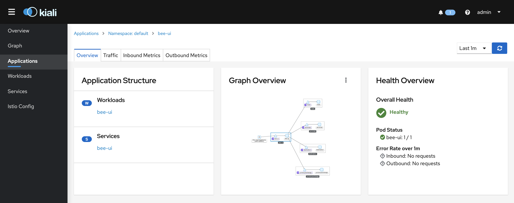

4. Navigate to the **Istio Config** panel on the left side of the dashboard. This provides the status of the mesh configuration in the `Configuration` column for all of the resources in the namespace. You can click on a specific configuration to view more information.
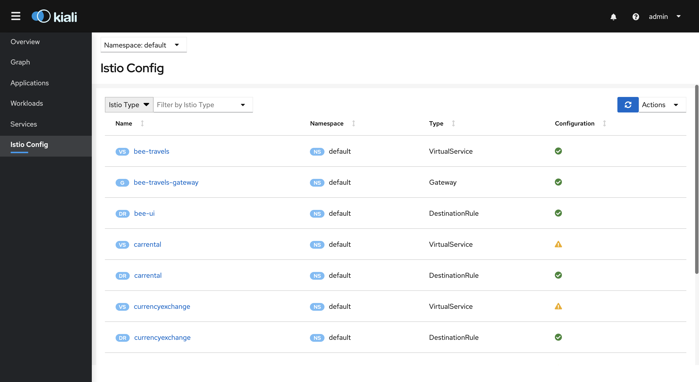

### View access logs

Envoy proxies can provide access information about the requests that the pod makes. 

1. [Enable access logging](https://cloud.ibm.com/docs/containers?topic=containers-istio#customize) by following steps 1 through 4 and adding `istio-global-proxy-accessLogFile: "/dev/stdout"` to the `data` section of the configmap. 
   > Your configmap should look like this:


2. Restart all of the pods to finish enabling access logs.
   ```
   $ kubectl delete po --all
   ```

3. Display a list of all of the pods and take note of the bee-ui pod name. Use the pod name to start the access logs for the `bee-ui` pod's Envoy proxy. 
   ```
   $ kubectl get po
   $ kubectl logs -f <bee-ui-pod-name> istio-proxy
   ```

4. Navigate to the application in the browser, enter a destination request. The access log shows that the UI service made an outbound GET request to `v3` of the car rental service based on my input and filters. 


# Troubleshooting

* Installing Artillery globally as root fails with permission error
   * As suggested [here](https://github.com/artilleryio/artillery/issues/714), try installing Artillery by running `npm install -g artillery --allow-root --unsafe-perm=true`

* Can I check if I have any issues with my Istio configuration?
   * The `istioctl analyze` command can detect possible issues within your cluster. You can also run the command against one or multiple configuration files to analyze the effect of applying them to your cluster. For example: `istioctl analyze istio/ex-virtualservice.yaml`
   * Kiali also has an **Istio Config** panel on the left side of the dashboard that will any warnings or errors in your mesh configuration.

* I'm running a load test with Artillery but only the `bee-ui` service is receiving traffic on Grafana.
   * Check to see that the `target` value in `artillery_load/artillery.yaml` does not have an extra `/` at the end of the address. (ex: "http://169.62.94.60")

* I'm getting a lot of 500 Internal Service Errors when generating traffic with Artillery or in the browser. 
   * Your deployments' resource limits may be being reached. Try running `watch -n1 kubectl top po` which displays the resource metrics for each pod updated every second. While this is running, generate traffic to the application to see if any of the pods are exceeding the resource limits set in their respective deployment files. 

## License

This code pattern is licensed under the Apache License, Version 2. Separate third-party code objects invoked within this code pattern are licensed by their respective providers pursuant to their own separate licenses. Contributions are subject to the [Developer Certificate of Origin, Version 1.1](https://developercertificate.org/) and the [Apache License, Version 2](https://www.apache.org/licenses/LICENSE-2.0.txt).

[Apache License FAQ](https://www.apache.org/foundation/license-faq.html#WhatDoesItMEAN)
